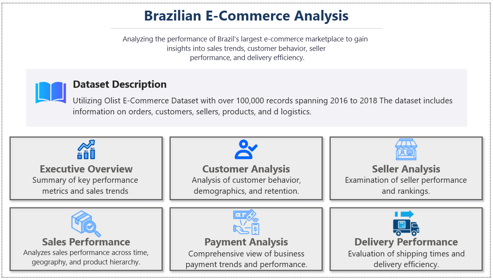
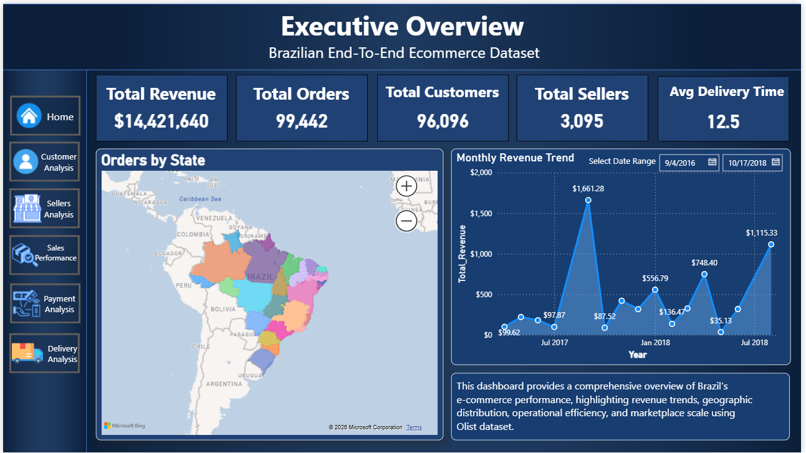
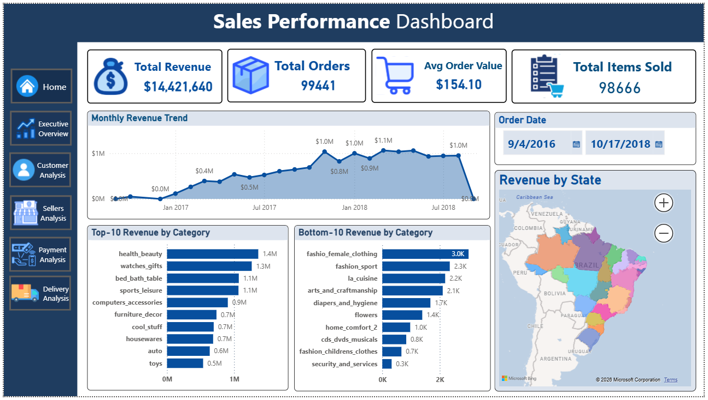
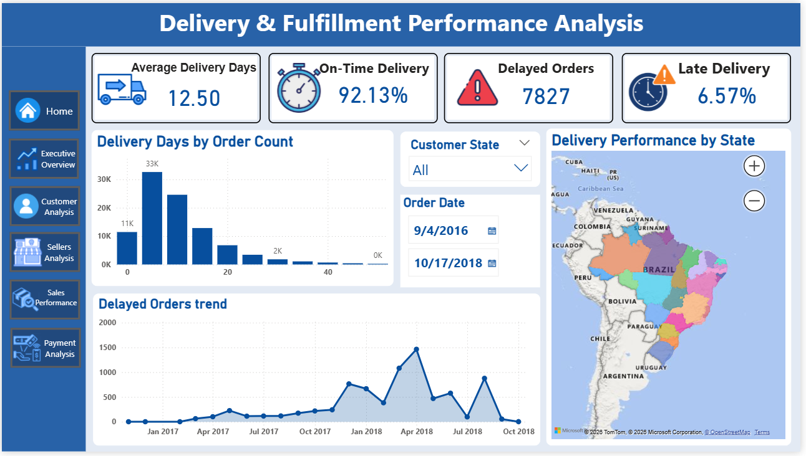
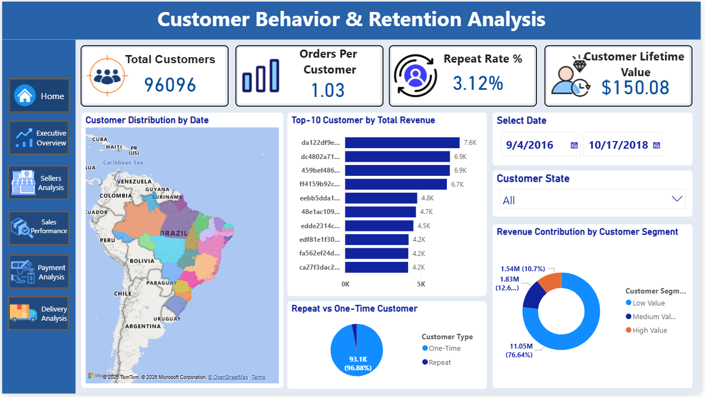
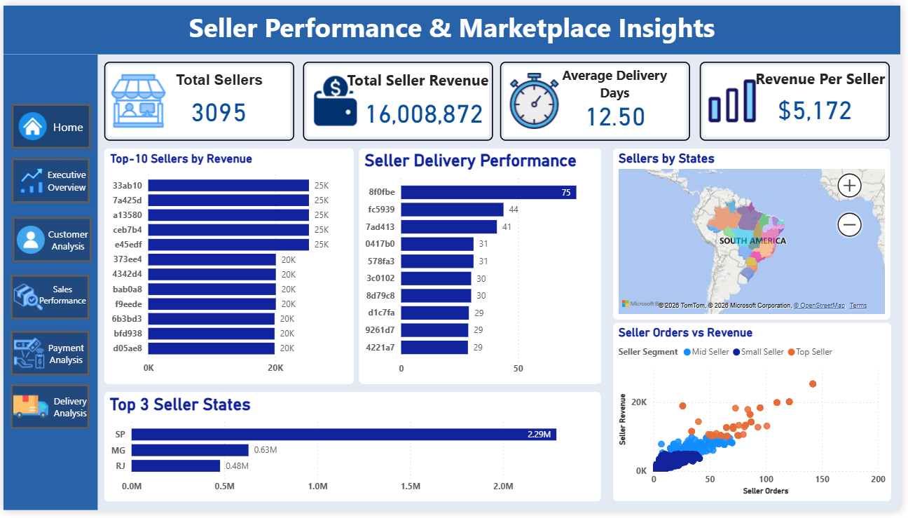
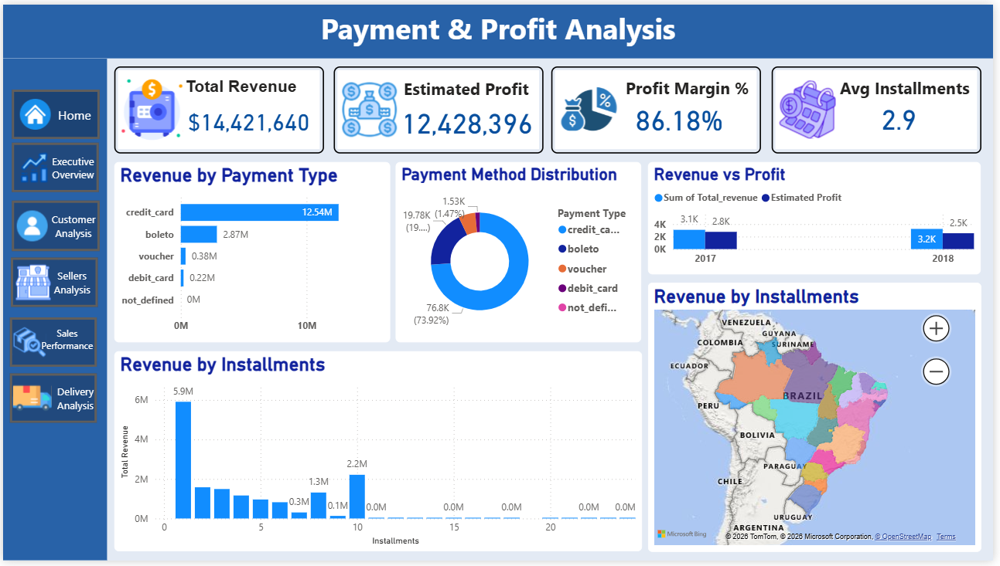

# Olist E-Commerce Analytics Dashboard (Power BI)

## Project Overview

This project presents an end-to-end business intelligence solution built using the Brazilian e-commerce dataset provided by Olist.

The goal of this project is to analyze marketplace operations, customer behavior, seller performance, delivery efficiency, and payment insights through interactive Power BI dashboards.

The project demonstrates skills in data cleaning, data modeling, DAX calculations, and dashboard storytelling.

---

## Dataset

Dataset Source:
Brazilian E-Commerce Public Dataset by Olist

The dataset contains information about:

* 100K+ orders
* Customers
* Sellers
* Products
* Payments
* Delivery logistics

---

## Tools Used

* Power BI
* Power Query
* DAX
* Data Modeling
* Data Visualization

---

## Dashboard Overview

This project includes 7 analytical dashboards:

1. Introduction Dashboard
2. Executive Overview
3. Sales Performance Analysis
4. Delivery Performance Analysis
5. Customer Behavior Analysis
6. Seller Performance Analysis
7. Payment & Profitability Analysis

---

## Key Business Insights

* Credit card payments dominate the platform.
* São Paulo generates the highest marketplace revenue.
* Average delivery time varies significantly across states.
* Repeat customer rate shows strong loyalty trends.

---

## Dashboard Previews

### Introduction



### Executive Overview



### Sales Performance



### Delivery Performance



### Customer Analysis



### Seller Analysis



### Payment & Profitability



---

## Project Structure

```
Olist-Ecommerce-PowerBI-Dashboard
│
├── dashboards
├── dataset
├── powerbi_file
└── README.md
```

---

## Author
Parth Sharma
Aspiring Data Scientist passionate about turning data into actionable insights using business intelligence tools.

---

## Future Improvements

* Add predictive sales forecasting
* Deploy dashboard to Power BI Service
* Create SQL data warehouse version
